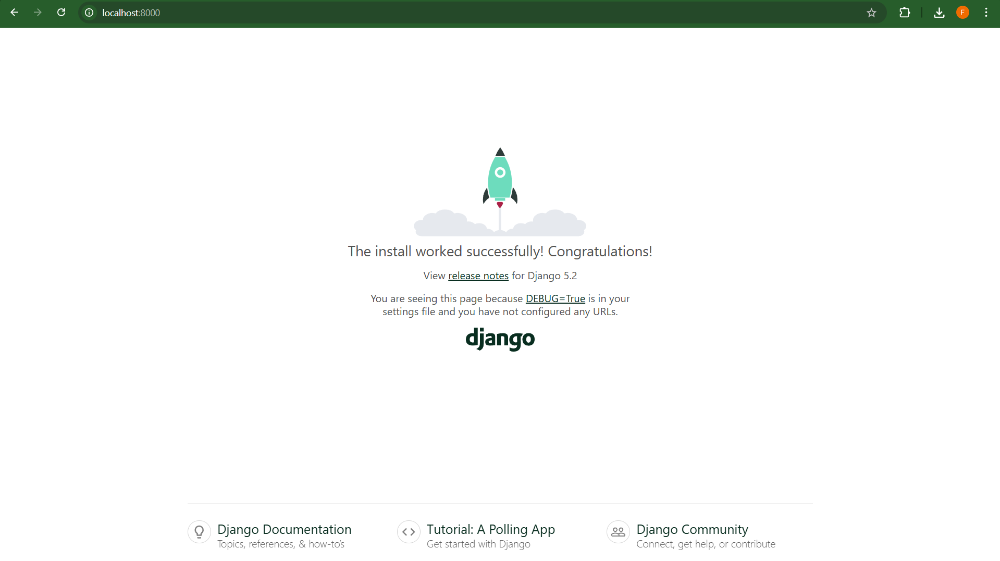

# Simple LMS (Django + Docker + PostgreSQL)

Project ini merupakan setup environment development menggunakan Docker untuk aplikasi Simple Learning Management System (LMS) berbasis Django dan PostgreSQL.

---

## Cara Menjalankan Project

1. Clone repository
2. Copy .env.example menjadi .env
3. Jalankan:
   docker-compose up --build
4. Jalankan migrate:
   docker-compose run web python manage.py migrate
5. Akses:
   http://localhost:8000

---

## Environment Variables

DEBUG=True  
SECRET_KEY=django-secret-key  

POSTGRES_DB=simple_lms  
POSTGRES_USER=postgres  
POSTGRES_PASSWORD=postgres  
POSTGRES_HOST=db  
POSTGRES_PORT=5432  

---

## Screenshot

