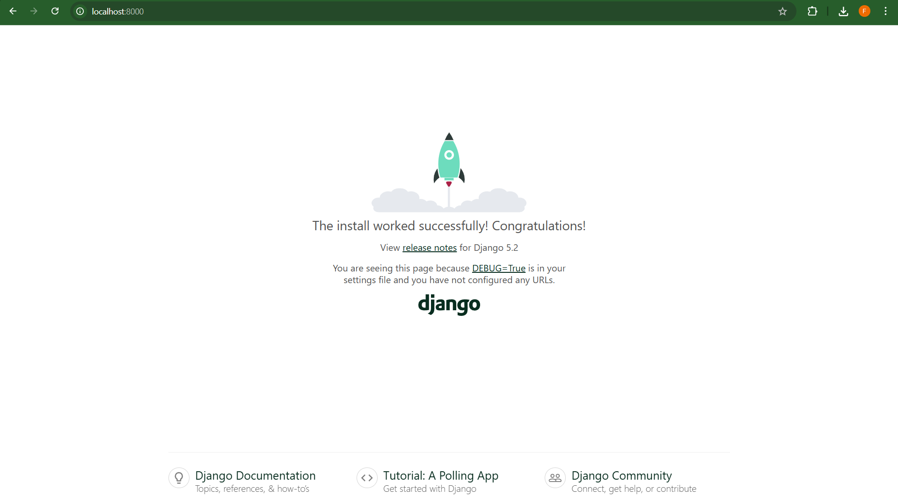

# Simple LMS (Django + Docker + PostgreSQL + Redis + MongoDB + RabbitMQ + Celery)

Project ini merupakan aplikasi **Simple Learning Management System (LMS)** berbasis Django yang didevelop dengan arsitektur modern menggunakan Django Ninja (REST API), PostgreSQL (Main Database), Redis (Caching & Rate Limiting), MongoDB (Analytics & Activity Logging), dan Celery + RabbitMQ (Asynchronous Task Queue).

---

## Cara Menjalankan Project

1. **Clone repository** ke direktori lokal Anda.
2. **Salin Environment Variables:**
   Pastikan file `.env` sudah dibuat di root project. Anda bisa menyalinnya dari file `.env.example`:
   ```bash
   cp .env.example .env
   ```
3. **Jalankan Docker Compose:**
   Buka terminal di root project dan jalankan perintah berikut:
   ```bash
   docker-compose up --build
   ```
4. **Jalankan Migrasi Database (Jika Belum Berjalan Otomatis):**
   ```bash
   docker-compose exec web python manage.py migrate
   ```
5. **Jalankan Seeding Data / Membuat Superuser:**
   Untuk membuat superuser admin pertama kali:
   ```bash
   docker-compose exec web python manage.py createsuperuser
   ```

---

## Akun Demo Pengujian

Gunakan akun-akun demo berikut untuk menguji sistem dengan role-based access control (RBAC) yang berbeda:

| Role | Username | Password | Email | Deskripsi |
| :--- | :--- | :--- | :--- | :--- |
| **Admin** | `admin_demo` | `adminpass123` | `admin@simplelms.com` | Memiliki akses penuh (termasuk delete course & lesson, ekspor laporan, dan melihat analytics). |
| **Instructor** | `instructor_demo` | `instructorpass123` | `instructor@simplelms.com` | Dapat membuat, mengedit, dan menghapus course & lesson milik sendiri. |
| **Student** | `student_demo` | `studentpass123` | `student@simplelms.com` | Dapat melihat courses, enroll ke course, menandai progress, dan melihat status belajarnya. |

*Catatan: Pastikan Anda mendaftarkan akun di atas atau menjalankannya terlebih dahulu sebelum melakukan login pengujian.*

---

## Daftar Endpoint Utama API

Dokumentasi interaktif OpenAPI/Swagger dapat diakses di: **`http://localhost:8000/docs`**

### 1. Authentication (`/api/auth`)
* `POST /api/auth/register` — Registrasi user baru (role: `student` atau `instructor`)
* `POST /api/auth/login` — Login dan mendapatkan JWT (Access + Refresh Token)
* `POST /api/auth/refresh` — Tukar Refresh Token dengan Access Token baru
* `GET /api/auth/me` — Melihat detail profil user yang login
* `PUT /api/auth/me` — Memperbarui profil user yang login

### 2. Courses (`/api/courses`)
* `GET /api/courses` — List courses dengan pagination, filter, dan Redis caching
* `GET /api/courses/{course_id}` — Detail course beserta daftar lesson-nya
* `POST /api/courses` — Membuat course baru (Instructor only)
* `PATCH /api/courses/{course_id}` — Mengedit data course (Course Owner only)
* `DELETE /api/courses/{course_id}` — Menghapus course (Admin only)

### 3. Lessons (`/api/lessons` & `/api/courses`)
* `POST /api/courses/{course_id}/lessons` — Membuat lesson baru untuk course (Course Owner only)
* `GET /api/courses/{course_id}/lessons` — Melihat semua lesson dalam course (Public)
* `GET /api/lessons/{lesson_id}` — Melihat detail lesson tertentu (Public)
* `PATCH /api/lessons/{lesson_id}` — Mengedit data lesson (Course Owner only)
* `DELETE /api/lessons/{lesson_id}` — Menghapus lesson (Course Owner / Admin only)

### 4. Enrollments & Progress (`/api/enrollments`)
* `POST /api/enrollments` — Mendaftar (enroll) ke course (Student only)
* `GET /api/enrollments/my-courses` — Melihat daftar course yang sedang diikuti student beserta progressnya
* `POST /api/enrollments/{enrollment_id}/progress` — Menandai status penyelesaian lesson (complete/incomplete)

### 5. Reports & Analytics (`/api/reports`)
* `GET /api/reports/courses/{course_id}/export` — Trigger ekspor CSV laporan statistik course (Admin only, dijalankan via Celery async)
* `GET /api/reports/analytics/top-courses` — Top course berdasarkan views di MongoDB (Admin only)
* `GET /api/reports/analytics/activity-summary` — Ringkasan log aktivitas harian dari MongoDB (Admin only)
* `GET /api/reports/courses/{course_id}/analytics` — Data statistik analytics course (Admin only)

---

## Screenshot

